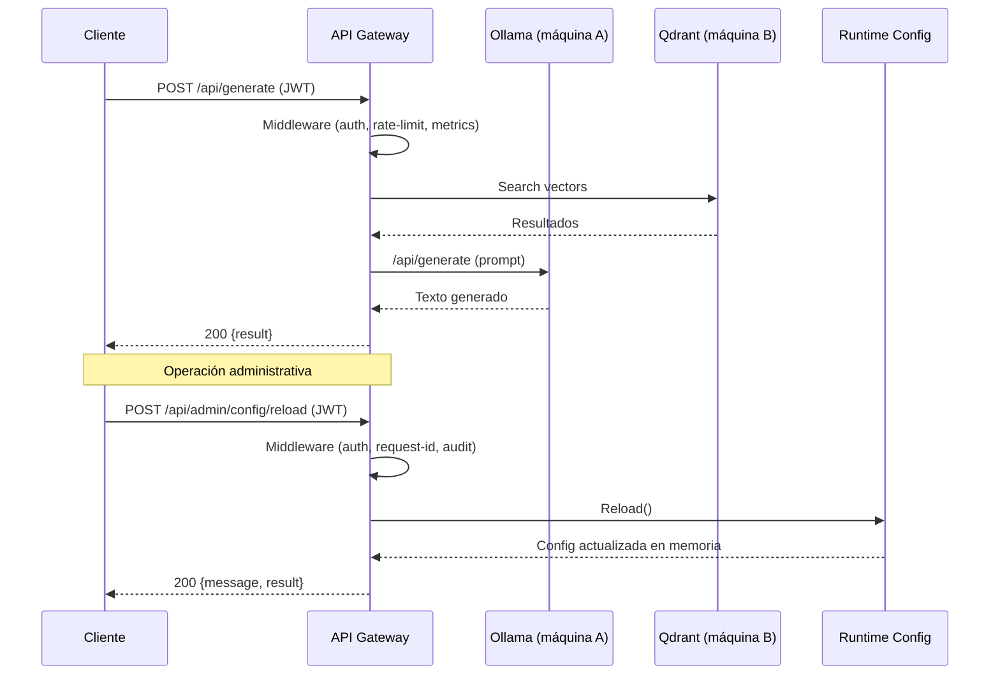

# Arquitectura

Resumen:
- El proyecto está organizado siguiendo Clean Architecture: módulos funcionales en `internal/function/*` (con `transport/service/domain` según necesidad), configuración en `internal/config`, servidor/wiring en `internal/server` y utilidades en `pkg/*`.
- El entrypoint es `cmd/server/main.go`, que carga configuración (`config.Load`), inicializa dependencias y crea `internal/server.New(cfg, cache)`.
- El enrutamiento HTTP usa `net/http` estándar (`http.ServeMux`) con pattern matching por método y path (Go 1.22+).

Componentes principales:
- Ollama: LLM externo (máquina A). Se comunica por HTTP con la API (`/api/generate`, `/api/embeddings`).
- Qdrant / MongoDB: persistencia y vector DB (máquina B).
- API Gateway (este repo): recibe peticiones, aplica middlewares (JWT, rate-limit, request-id, metrics), delega a servicios.
- Runtime Config: módulo `internal/function/runtime_config` para recarga de configuración en caliente vía endpoint administrativo.

Flujo típico (Generate):
1. Cliente -> `POST /api/generate` (JWT obligatorio).
2. Middleware valida token, registra request-id y métricas.
3. Handler delega a `RAGService` que: obtiene embeddings (cache local LRU+TTL), consulta Qdrant, construye prompt y llama a Ollama.
4. Respuesta devuelta al cliente.

Flujo administrativo (Reload Config):
1. Operador -> `POST /api/admin/config/reload` (JWT obligatorio).
2. Middleware valida autorización y trazabilidad.
3. `runtime_config.Service` vuelve a cargar configuración desde env/`CONFIG_FILE`.
4. Configuración se aplica en memoria sin reiniciar el proceso.

Diagrama (Mermaid):

Consideraciones de despliegue:
- Mantener Ollama en una máquina separada con acceso controlado.
- Asegurar baja latencia entre la API y la máquina B cuando se consultan vectores.
- La cache de embeddings local reduce llamadas repetidas a Ollama.
- Si se usa `CONFIG_FILE`, validar cambios en entorno controlado antes de ejecutar `/api/admin/config/reload`.
