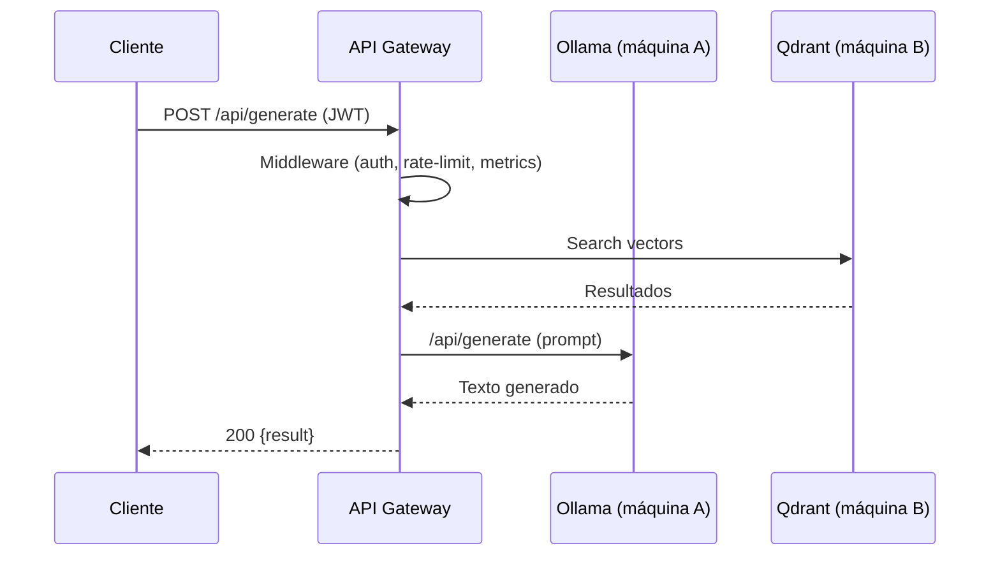

# Arquitectura

Resumen:
- El proyecto está organizado siguiendo Clean Architecture: capa de presentación (`internal/handlers`), lógica de negocio (`internal/services`), modelos (`internal/domain`), configuración (`internal/config`) y utilidades (`pkg/httputil`).
- El entrypoint es `cmd/server/main.go` que crea `internal/server.New(cfg)` y arranca el HTTP server.

Componentes principales:
- Ollama: LLM externo (máquina A). Se comunica por HTTP con la API (`/api/generate`, `/api/embeddings`).
- Qdrant / MongoDB: persistencia y vector DB (máquina B).
- API Gateway (esta repo): recibe peticiones, aplica middlewares (JWT, rate-limit, request-id, metrics), delega a servicios.

Flujo típico (Generate):
1. Cliente -> `POST /api/generate` (JWT obligatorio).
2. Middleware valida token, registra request-id y métricas.
3. Handler delega a `RAGService` que: obtiene embeddings (cache local LRU+TTL), consulta Qdrant, construye prompt y llama a Ollama.
4. Respuesta devuelta al cliente.

Diagrama (Mermaid):

Consideraciones de despliegue:
- Mantener Ollama en una máquina separada con acceso controlado.
- Asegurar baja latencia entre la API y la máquina B cuando se consultan vectores.
- La cache de embeddings local reduce llamadas repetidas a Ollama.
